# DPDMS — Architecture

All diagrams below are [Mermaid](https://mermaid.js.org). GitHub renders them
automatically in the browser. To export one as an image for the report or the
slides, paste it into https://mermaid.live and click *Download PNG/SVG*.

---

## 1. System context

Who uses the system and what it talks to.

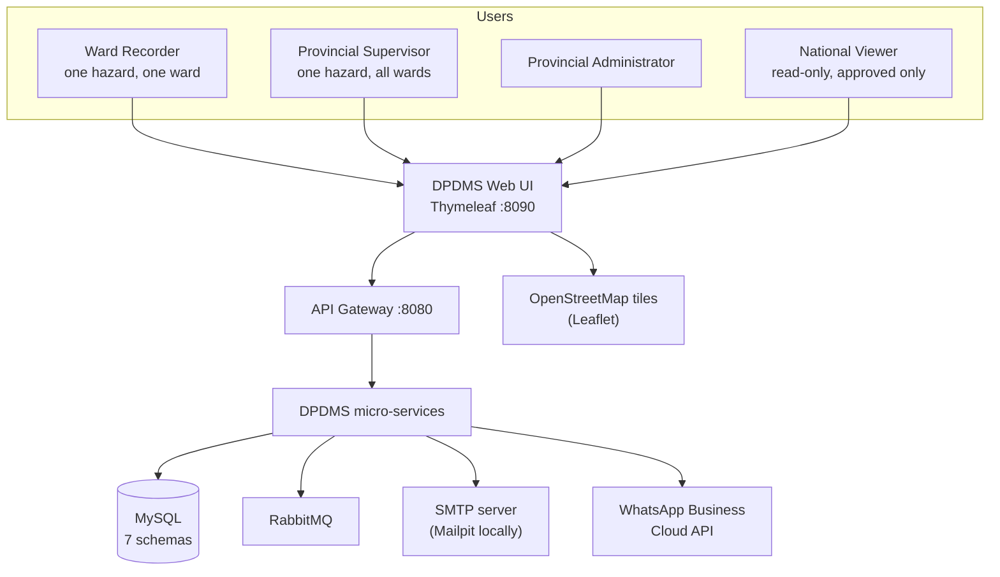

---

## 2. Component / deployment view

Every box is a separately runnable Spring Boot application.

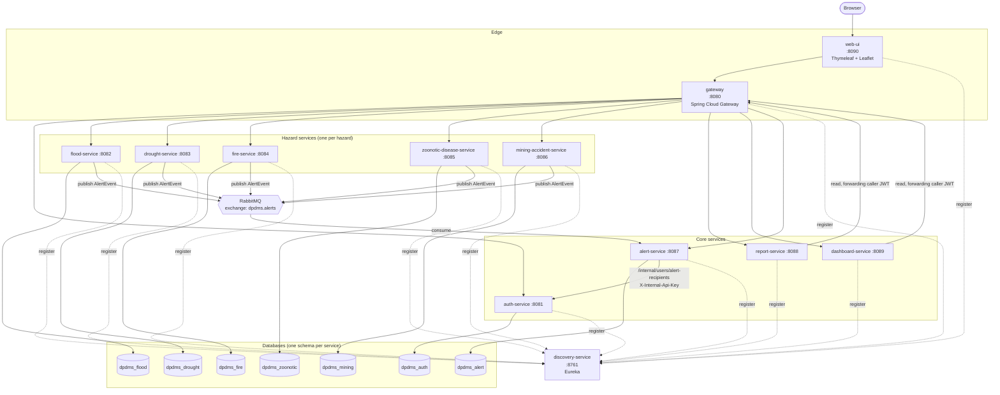

Note the two directions of traffic:

- **Writes** go browser → web-ui → gateway → hazard service → its own database.
- **Cross-hazard reads** (reports, dashboard) never touch another service's
  database. They call the owning service's API, forwarding the caller's JWT, so
  access control is applied by the owner, not re-implemented by the reader.

---

## 3. Package structure of the shared `common` module

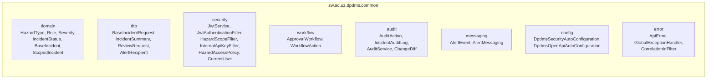

`common` is packaged as a plain JAR with Spring Boot auto-configuration entries,
so every service gets the same security stack by adding one dependency. This is
the mechanism that makes "enforced in the backend, in every service" true rather
than aspirational.

---

## 4. Domain model

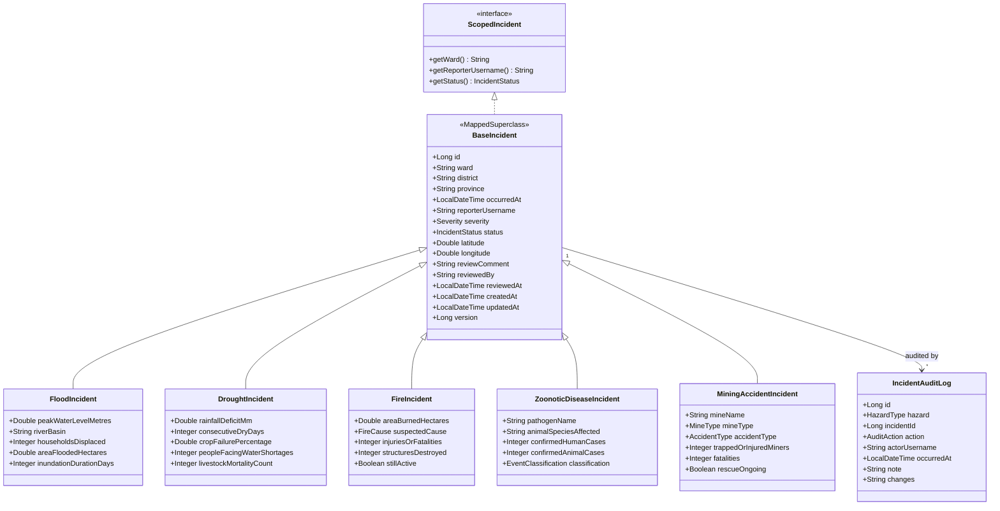

This is the assignment's core OOP demonstration:

- **Inheritance** — `BaseIncident` holds the metadata every hazard shares
  (`@MappedSuperclass`, so each hazard still gets its own table in its own
  schema, no shared-table coupling).
- **Abstraction / interface** — `ScopedIncident` is all `HazardAccessPolicy`
  needs to know about an incident. The policy has no idea floods exist.
- **Polymorphism** — the report and dashboard services handle all five hazards
  through `IncidentSummary`, a single projection type.
- **Encapsulation** — status changes are only reachable through
  `ApprovalWorkflow`; there is no public setter that lets a caller jump from
  `PENDING` straight to `APPROVED` without an audit entry.

---

## 5. Sequence: recording an incident that triggers an alert

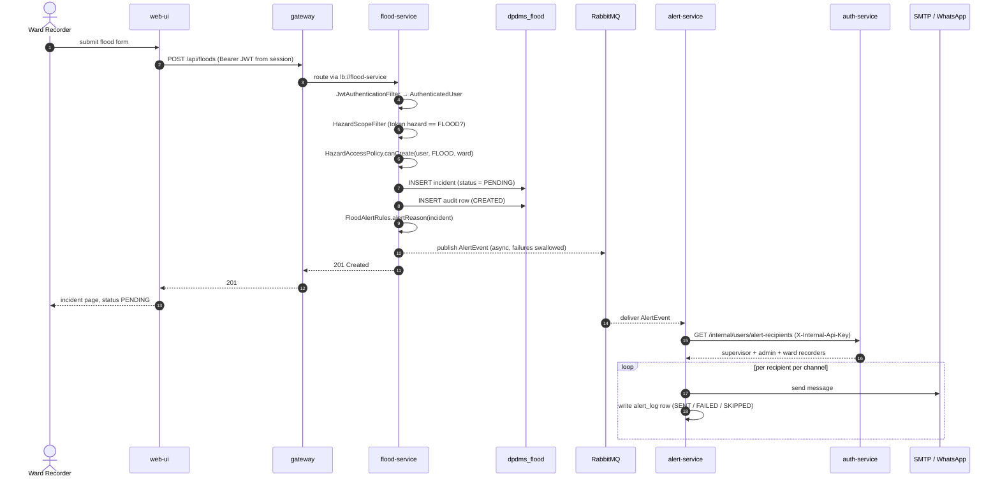

The recorder's request returns as soon as the row is committed. Everything after
step 12 happens on the broker's thread — an SMTP outage cannot slow down or fail
data capture.

---

## 6. Sequence: approval, with the cross-hazard refusal

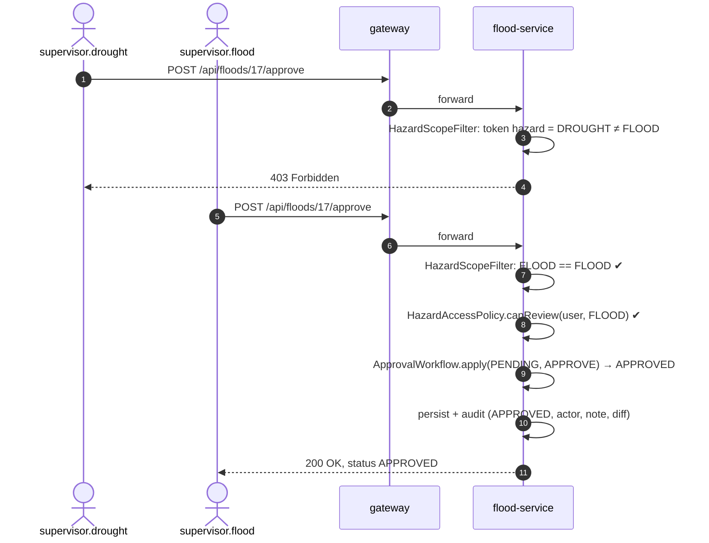

---

## 7. Approval state machine

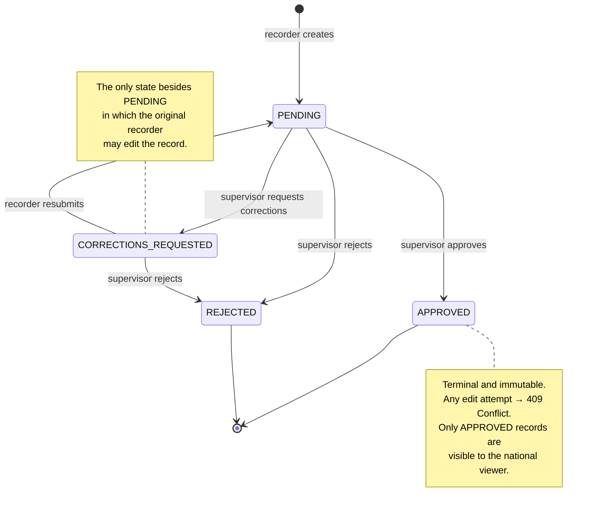

---

## 8. Security layers

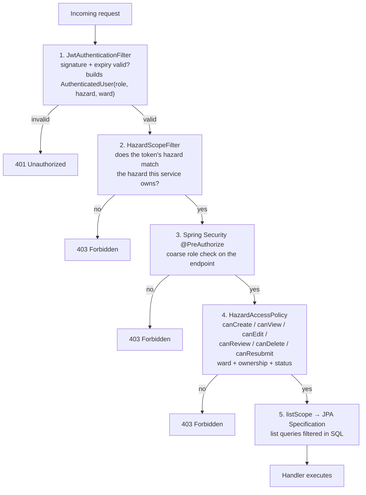

Layers 1, 2, 4 and 5 run **inside every service**, not at the gateway. The
gateway is a router and a convenience, not a security boundary: a request that
somehow reached `flood-service` directly on port 8082 is checked identically.

---

## 9. Alert dispatch detail

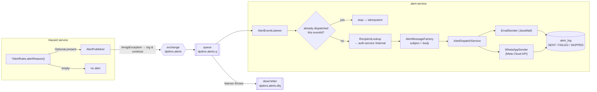

---

## 10. Database schemas

One schema per service. No service reads another service's tables — ever.

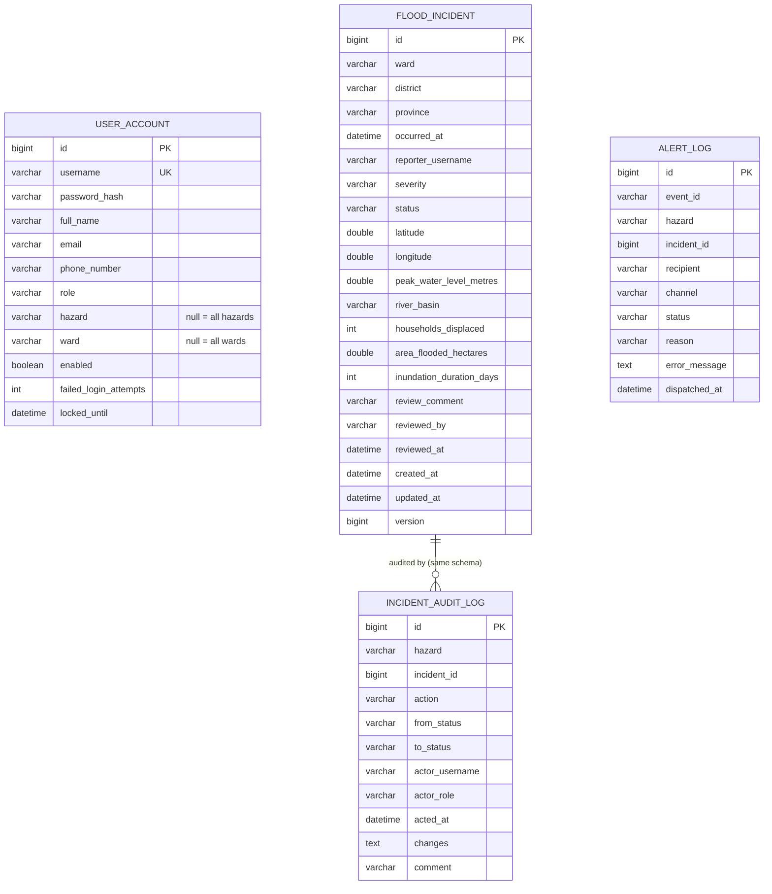

`incident_audit_log` exists **in each hazard schema**, so an audit record can
never be orphaned from the incident it describes. `alert_log` lives alone in
`dpdms_alert` and references incidents only by `(hazard, incident_id)`.

The other four hazard tables are structurally identical to `flood_incident`;
only the five indicator columns differ. See each service's
`src/main/resources/db/migration/V1__*.sql` for the exact DDL.

---

## 11. Build-time module graph

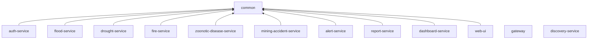

`gateway` and `discovery-service` deliberately do **not** depend on `common` —
they hold no business rules, so there is nothing for them to share. `web-ui`
depends on `common` for the enums and DTOs but explicitly **excludes**
`DpdmsSecurityAutoConfiguration`, because it authenticates with a server-side
session rather than a bearer token.
